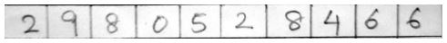
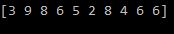

# Handwritten_Digit_Recognizer
 Firstly, I train the models using MNIST Dataset and ccompare them to find MLPClassifier() perform the best.
 The numbers are written in grid. The extraction of digits from the grid is the main task. Using opencv library, I try to detect the horizontal and vertical lines, and extract the digits. Finally, convert 28x28 image to 784 array to input it into the model for prediction.
  Following result is observed:-
 
 <b> Image of test data
 
 
 
 Detection of digits </b>
 
 
 
